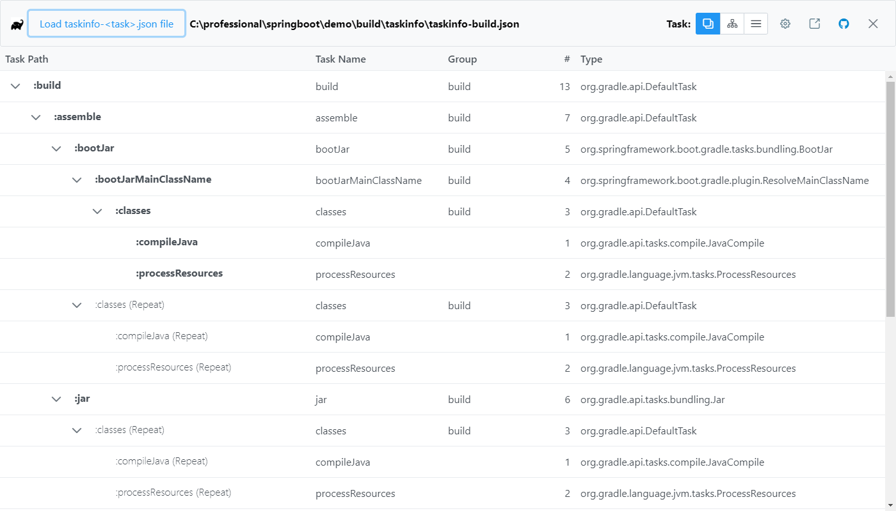
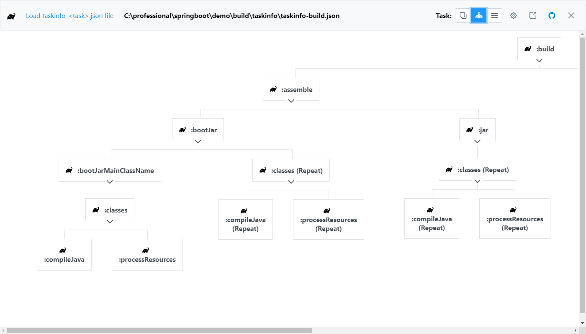
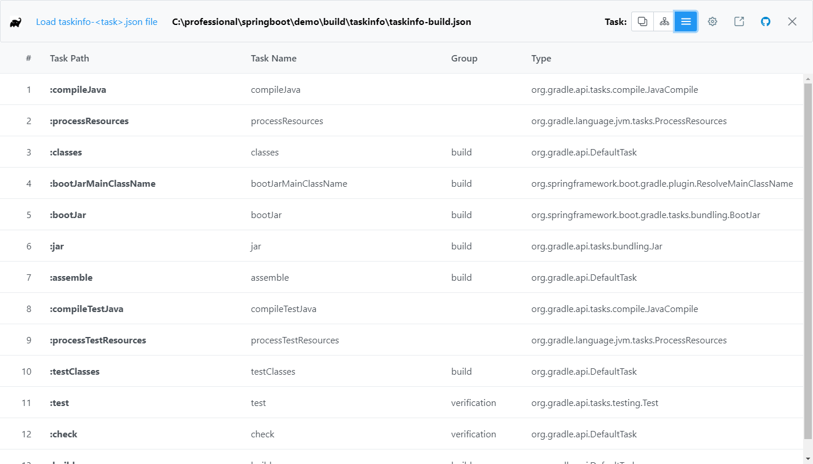

# taskinfo-viewer

Angular Electron based viewer for output of gradle-taskinfo plugin output:

```
gradlew tiJson taskname
```

The output can be found in:

```
build\taskinfo\taskinfo-build.json
```
## Task Tree View



## Task Org View



## Task Order View


